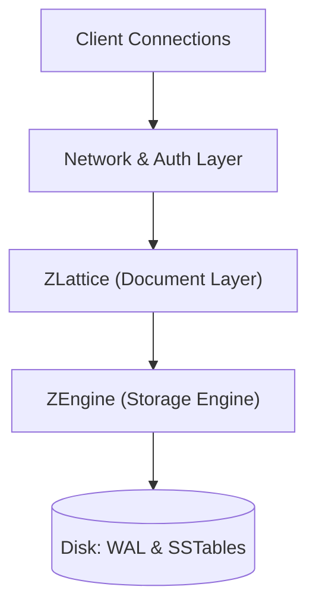
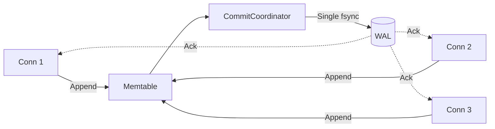

# ZydecoDB Architecture

*ZydecoDB is built on ZEngine, a Rust LSM storage engine, with ZLattice, the document layer that speaks ZDoc. Four pillars make it fast and unkillable: Straightline evaluation, Caravan commits, Tidewalker compaction, and HotSwap runtime.*

This document details the core architectural pillars that enable ZydecoDB to achieve high throughput, low latency, and zero-downtime operational management.

## Separation of Concerns: ZEngine vs. ZLattice

The architecture is strictly divided into two primary components to ensure modularity and separation of concerns:

1. **ZEngine (`zydecodb-engine`)**: A pure, embedded Key-Value Log-Structured Merge (LSM) tree. It operates entirely on raw bytes, managing the Write-Ahead Log (WAL), Memtables, and SSTables. It has no concept of JSON, documents, or schemas.
2. **ZLattice (`zydecodb-document`)**: A stateless evaluation and indexing layer that sits on top of the engine. It defines the `ZDoc` binary format, executes queries, and manages secondary indexes.



---

## Pillar 1: Straightline (Zero-Copy Binary Evaluation)

Most document databases suffer from a "parse tax" during unindexed queries, wasting CPU cycles deserializing JSON strings into memory-heavy DOM trees just to evaluate a filter.

ZydecoDB bypasses this entirely using **Straightline** evaluation. By storing data in the `ZDoc` binary format, the `ValueView` struct navigates the raw byte array by jumping pointers based on field lengths. It skips irrelevant fields in a straight line without allocating memory or parsing strings.

### Performance Impact
In local benchmarks, ZydecoDB performs an unindexed full collection scan of 50,000 complex documents in **~10,215ms** (evaluating roughly **4,894 documents per second**).

*Note: While 5,000 documents evaluate in ~80ms (62,500 docs/sec) when fully cached in L1/L2 CPU cache, the 50,000 document benchmark (10.2s) reflects the true performance when the working set exceeds the CPU cache and requires traversing the 64MB block cache and streaming 10,000 matching JSON objects over the TCP socket to the client.*

### Implementation
The evaluation path defers full materialization until the document is confirmed to match the filter:

```rust
fn check_filter<'a>(stored: &'a [u8], filter: &crate::filter::Filter, doc_id: &[u8]) -> bool {
    let kind = stored[0];
    let payload = crate::store::strip_value_kind(stored);
    
    let view = if kind == crate::store::VK_ZDOC {
        // Zero-copy pointer into the binary payload
        crate::binary::ValueView::new(payload)
    } else {
        // Fallback for legacy JSON
        // ...
    };
    
    filter.matches(view, Some(doc_id))
}
```

---

## Pillar 2: Caravan (Asynchronous Group Commit)

When running with strict synchronous durability (`durability = "sync"`), every write must be `fsync`'d to the Write-Ahead Log (WAL) before acknowledging the client. If every connection locked the database to perform disk I/O, throughput would collapse.

ZydecoDB solves this using **Caravan** commits via the `CommitCoordinator`. The WAL synchronization is decoupled from the main engine lock. Concurrent writes from multiple connection threads are batched together into a single "caravan" and flushed to disk in one `fsync`. This saturates disk IOPS while keeping the engine lock highly available for readers and memtable inserts.

### Performance Impact
With synchronous durability enabled, a single local node achieves **~8,700 durable writes per second**.



---

## Pillar 3: Tidewalker (Dynamic LSM Compaction)

To maintain predictable read amplification under heavy write loads, ZEngine employs a dynamic, leveled compaction strategy (L0 → L1 → L2).

As the Memtable flushes to L0 SSTables, the **Tidewalker** background worker (`CompactionPlanner`) evaluates per-level scores. When a level exceeds its dynamic byte target, the worker performs a k-way merge of overlapping files into the next level. This process continuously garbage-collects deleted or overwritten data in the background without blocking foreground query execution.

---

## Pillar 4: HotSwap (Wait-Free Configuration Swapping)

In a multi-tenant environment, operational tasks like provisioning new tenants, rotating API keys, or adjusting rate limits must happen without dropping active connections or stalling the accept loop.

ZydecoDB uses **HotSwap** for true zero-downtime, lock-free configuration reloads. When the server receives a `SIGHUP` signal, a dedicated thread loads the new `keys.toml` from disk and performs an atomic pointer swap using `arc-swap`.

Because there is no `RwLock` involved, new connections authenticating against the `KeyStore` never contend for read locks, ensuring the connection initialization path remains entirely wait-free.

```rust
// In the SIGHUP signal handler:
match crate::security::keys::KeyStore::load(&keys_file) {
    Ok(store) => {
        tenant_limits.reload(store.tenant_records());
        // Atomic pointer swap; no read locks blocked
        security_keys.store(Arc::new(store));
        info!("reloaded keys and per-tenant limits on SIGHUP");
    }
    Err(e) => warn!(error = %e, "SIGHUP reload failed"),
}
```

---

## Not shipping (superseded)

| Direction | Replaced by |
|-----------|-------------|
| FlatBuffers typed values | **ZDoc** binary (`VK_ZDOC = 0x01`) in `zydecodb-document` |
| Glommio / io_uring / thread-per-core | **std threads** + `EngineHandle` (write mutex + separate cache/fair/WAL sync domains) |
| RESP2 Redis wire / HTTP REST document API | **Length-prefixed binary** frames on TCP/UDS (`zydecodb-engine::frame`) |

Sources of truth: [`DOCUMENT_STORE.md`](DOCUMENT_STORE.md), this file, [`SECURITY.md`](SECURITY.md).