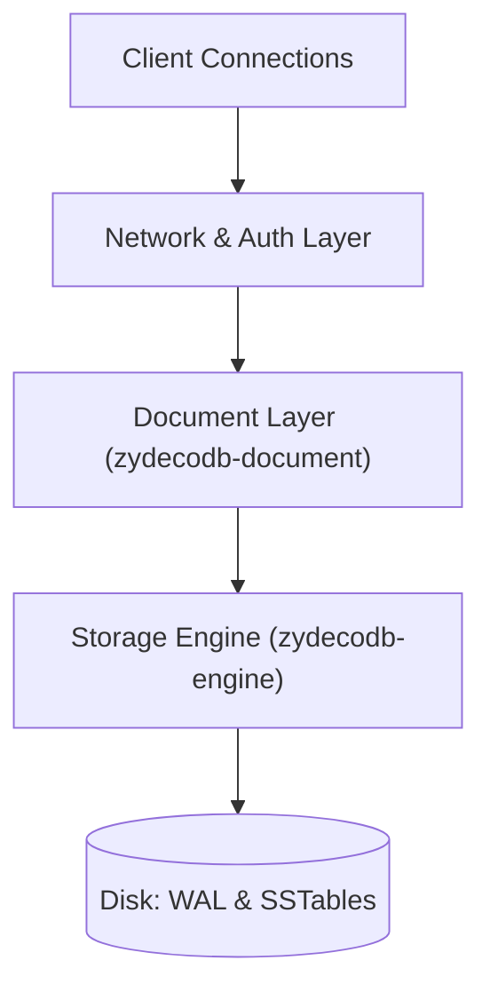
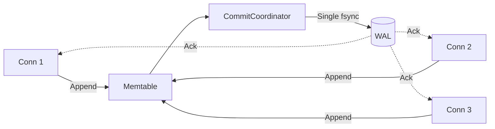

# ZydecoDB Architecture

ZydecoDB is a high-performance, multi-tenant document database built in Rust. It is designed to provide the flexibility of a document store without sacrificing the rigorous durability and performance characteristics of a low-level key-value engine. 

This document details the core architectural pillars that enable ZydecoDB to achieve high throughput, low latency, and zero-downtime operational management.

## Separation of Concerns: Engine vs. Document Layer

The architecture is strictly divided into two primary crates to ensure modularity and separation of concerns:

1. **`zydecodb-engine`**: A pure, embedded Key-Value Log-Structured Merge (LSM) tree. It operates entirely on raw bytes, managing the Write-Ahead Log (WAL), Memtables, and SSTables. It has no concept of JSON, documents, or schemas.
2. **`zydecodb-document`**: A stateless evaluation and indexing layer that sits on top of the engine. It defines the `ZDoc` binary format, executes queries, and manages secondary indexes.



---

## Pillar 1: Zero-Copy Binary Evaluation (`ValueView` / `ZDoc`)

Most document databases suffer from a "parse tax" during unindexed queries, wasting CPU cycles deserializing JSON strings into memory-heavy DOM trees just to evaluate a filter.

ZydecoDB bypasses this entirely using a custom binary format (`ZDoc`) and a zero-copy evaluation struct called `ValueView`. When evaluating a query, `ValueView` navigates the raw byte array by jumping pointers based on field lengths. It skips irrelevant fields without allocating memory or parsing strings.

### Performance Impact
In local benchmarks, ZydecoDB performs an unindexed full collection scan of 5,000 complex documents in **~80ms** (evaluating roughly **62,500 documents per second**), entirely bypassing the overhead of `JSON.parse()`.

### Implementation
The evaluation path defers full materialization until the document is confirmed to match the filter:

```rust
fn check_filter<'a>(stored: &'a [u8], filter: &crate::filter::Filter, doc_id: &[u8]) -> bool {
    let kind = stored[0];
    let payload = crate::store::strip_value_kind(stored);
    
    let view = if kind == crate::store::VK_ZDOC {
        // Zero-copy pointer into the binary payload
        crate::binary::ValueView::new(payload)
    } else {
        // Fallback for legacy JSON
        // ...
    };
    
    filter.matches(view, Some(doc_id))
}
```

---

## Pillar 2: Asynchronous Group Commit Pipeline

When running with strict synchronous durability (`durability = "sync"`), every write must be `fsync`'d to the Write-Ahead Log (WAL) before acknowledging the client. If every connection locked the database to perform disk I/O, throughput would collapse.

ZydecoDB solves this using the `CommitCoordinator`. The WAL synchronization is decoupled from the main engine lock. Concurrent writes from multiple connection threads are batched together into a single disk flush (Group Commit), saturating disk IOPS while keeping the engine lock highly available for readers and memtable inserts.

### Performance Impact
With synchronous durability enabled, a single local node achieves **~8,700 durable writes per second**.



---

## Pillar 3: Dynamic LSM Compaction

To maintain predictable read amplification under heavy write loads, `zydecodb-engine` employs a dynamic, leveled compaction strategy (L0 → L1 → L2).

As the Memtable flushes to L0 SSTables, a dedicated background worker (`CompactionPlanner`) evaluates per-level scores. When a level exceeds its dynamic byte target, the worker performs a k-way merge of overlapping files into the next level. This process continuously garbage-collects deleted or overwritten data without blocking foreground query execution.

---

## Pillar 4: Wait-Free Configuration Swapping

In a multi-tenant environment, operational tasks like provisioning new tenants, rotating API keys, or adjusting rate limits must happen without dropping active connections or stalling the accept loop.

ZydecoDB's `SecurityRuntime` uses `arc-swap` to achieve true zero-downtime, lock-free configuration reloads. When the server receives a `SIGHUP` signal, a dedicated thread loads the new `keys.toml` from disk and performs an atomic pointer swap.

Because there is no `RwLock` involved, new connections authenticating against the `KeyStore` never contend for read locks, ensuring the connection initialization path remains entirely wait-free.

```rust
// In the SIGHUP signal handler:
match crate::security::keys::KeyStore::load(&keys_file) {
    Ok(store) => {
        tenant_limits.reload(store.tenant_records());
        // Atomic pointer swap; no read locks blocked
        security_keys.store(Arc::new(store));
        info!("reloaded keys and per-tenant limits on SIGHUP");
    }
    Err(e) => warn!(error = %e, "SIGHUP reload failed"),
}
```