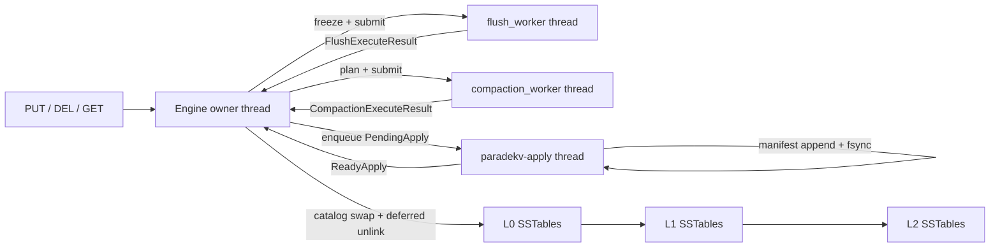

# L2 compaction scheduling issue and soak validation

Status: **MEMO6** — compaction and GC stable. GA path: **640 MB data block cache**, metadata pinned per reader (`max_open_readers=128`), **result cache off**, **derived RSS gate**. See [ENGINE-GA.md](ENGINE-GA.md).

Related: [PRODUCTION-READINESS.md](PRODUCTION-READINESS.md), [ENGINE-GA.md](ENGINE-GA.md).

---

## Summary

Under sustained write load (~3000 ops/sec), ParadeKV’s L2 SSTable count grows without bound (observed **19–26 files** in 30-minute runs; analyzer gate is **≤ 10** after physics alignment). Root causes are layered:

1. **Planner starvation (fixed):** fixed L0→L1→L2 order let L0 always win at 3k ops/s.
2. **Hysteresis trap (fixed):** L2 priority at count > 4 refilled via L1→L2 faster than chunked merges drained.
3. **Disjoint-file merge trap (fixed):** L1→L2 promotions can create non-overlapping L2 fragments. Subset merges of disjoint files do not reduce file count. **Fix:** RocksDB-style **overlap-merge on promotion** (L1 file + overlapping L2 files → packed outputs at `target_file_bytes`). Steady-state whole-level repack was removed after `phase1-repack-fix` showed repack-at-4 caused ~1,911 jobs and 0.94 throughput.

4. **Repack oscillation (removed):** Whole-level repack at `count >= 4` fixed L2 count briefly but created a limit cycle (repack → promote → re-fragment → repack).

5. **False-positive repack at physics floor (fixed, MEMO2):** Emergency repack at `count >= 8` fired when L2 reached the natural packed floor (~8×64 MB files at ~500 MB live). Repack cannot reduce count when files are already target-sized and disjoint; it only rewrote ~512 MB/min (~32 jobs/min) and starved L0. **Fix:** remove L2 from the compaction scorer entirely; delete emergency repack and all `plan_max_level*` paths; add `same_level_compaction_would_make_progress()` guard in `plan_compaction_job()` as structural insurance.

Separate work moved **compaction** and **memtable flush** off the synchronous write path (background OS threads). That fixed multi-second **inline** stalls but exposed L2 lifecycle as the next bottleneck.

---

## Architecture context



- **Planner** (`crates/engine/src/compaction.rs`): pure function over catalog snapshot; picks one job.
- **Worker** (`crates/engine/src/compaction_worker.rs`): merge + SSTable I/O; no manifest mutation.
- **Apply thread** (`crates/engine/src/apply_worker.rs`): unified queue for flush + compaction; **manifest fsync before** publishing to owner.
- **Engine owner** (`publish_catalog_apply`): in-memory catalog swap + deferred unlink only (no manifest I/O on poll hot path).

Default compaction config (`CompactionConfig::default()`):

| Field | Default | Role |
|-------|---------|------|
| `l0_trigger` | 4 | L0 file count before L0→L1 job |
| `l1_target_bytes` | 256 MB | L1 byte target |
| `level_size_multiplier` | 10 | L2 byte target = 2.5 GB (rarely hit at soak scale) |
| `max_level` | 2 | Top level (destination only — not a compaction source) |
| `soft_pending_compaction_bytes` | 256 MB | Write micro-delay when compaction debt exceeds |
| `hard_pending_compaction_bytes` | 512 MB | Write stall when compaction debt exceeds |
| `target_file_bytes` | 64 MB | Output pack size; physics floor ≈ `ceil(L2_bytes / 64MB)` files |

---

## Current planner (score-based + dynamic levels)

```text
plan():
  levels = levels_by_score()   # all levels with score >= 1.0, highest first
  for level in levels:
    if job = plan_for_level(level): return job
```

Per-level scores (RocksDB-style):

- **L0:** `max(file_count / l0_trigger, bytes / l1_target_bytes)`
- **L1..Lmax-1:** `bytes / effective_level_target(level)` (dynamic targets sized bottom-up from actual L2 footprint)
- **Lmax (L2):** not scored — destination only; L1 score drives L1→L2 promotion

Additional rules:

- **L1→L2 / L0→base:** oldest level-N file + **all overlapping** files at level N+1 (standard leveled compaction). L0 may skip to L2 when L1 has no effective target.
- **No L2 self-jobs:** no same-level L2 compaction, no emergency repack. **8–10 target-sized L2 files is healthy** at soak scale (~500 MB live).
- **No-progress guard:** `same_level_compaction_would_make_progress()` rejects same-level jobs that cannot reduce file count; increments `compaction_rejected_no_progress` (analyzer hard gate == 0).
- **Tie-break:** at equal score, lower level wins.
- **Backpressure:** `estimate_pending_bytes()` with soft/hard limits; micro-delay on PUT when debt is high.
- **Apply:** batched manifest records (one fsync per compaction apply).
- **Coalescing:** single-slot pending job when worker busy (highest score wins).

Honesty metrics in soak samples: `l2_median_size_bytes`, `compaction_write_amp`, `compaction_repack_total`, `compaction_rejected_no_progress`, `block_cache_hit_rate_window`, `block_cache_compaction_reads_window`, `result_cache_hit_rate_window`, `disk_bytes_total`, `logical_live_bytes`, `space_amplification`, `pending_compaction_bytes`. Integration tests: `crates/engine/tests/l2_promotion.rs`, `block_cache.rs`, `result_cache.rs`.

### Physics vs gate (MEMO3)

Soak RSS ~560 MB with 64 MB target files implies a **~9-file floor** even with perfect packing. The flat **L2 ≤ 10** ceiling was removed (MEMO3): analyzer uses **bytes-derived** count — per steady sample `ceil(sstables_l2 × l2_median_size_bytes / 64MB) + 2`. **13 L2 files at ~64 MB median is healthy data**, not a planner failure. Pass criteria also require **L2 median file size** ≥ `target_file_bytes / 2`, **compaction_write_amp** < 5, **compaction_repack_total** == 0, and **compaction_rejected_no_progress** == 0.

### Remaining risks

- **Single compaction worker** — sufficient at soak scale if overlap-merge avoids repack storms.
- **30m gate** — must pass all ceilings after overlap-merge (see `phase1-overlap-merge` run).

---

## Related write-path and measurement issues

These were addressed in parallel but affect how soak numbers should be read.

### Inline compaction on flush (fixed)

Previously `Engine::flush_oldest_immutable()` ran compaction inline after every flush, causing **3–10 s** stalls on the write path. Compaction now runs on `paradekv-compaction` thread; flush runs on `paradekv-flush` thread.

### `poll_compaction()` on PUT/DEL (fixed)

Calling `poll_compaction()` inside `put`/`del` applied large compaction results synchronously on the write path. Apply was moved out; put/del only `try_submit_flush()` and `maybe_submit_compaction()`.

### Soak harness latency attribution (adjusted)

`engine-soak` records per-op latency, then calls `poll_compaction()`. If `poll` runs **after** timing, a slow **apply** on the next iteration’s **poll-before-op** path can inflate **throughput** loss (loop duty cycle) without always appearing in `max_us` for the timed op.

Default harness order (50ms background poll):

```text
rate.acquire()
if elapsed_since_last_poll >= poll_compaction_ms:   # default 50
    poll_compaction()
t0 = now()
run PUT/GET/DEL/SCAN
record(now() - t0)
```

`--poll-compaction-ms 0` restores the legacy **per-op** poll (stress mode).

With the default 50ms cadence, apply work is amortized like production; the **0.95 throughput** gate measures ingest rate, not poll-loop duty cycle.

---

## Soak testing methodology

### Purpose

Soak tests are **not** peak-throughput benchmarks. They answer operational questions over time:

- Does RSS / FD count stabilize?
- Does immutable memtable queue stay bounded?
- Does **L2 file count plateau**?
- Do p99 / max op latencies stay within SLO?
- Any errors over hours?

Harness: `crates/engine/src/bin/engine-soak.rs`  
Driver: `scripts/soak.sh`  
Analyzer: `scripts/analyze-soak.py`

### Running a soak

```bash
# 30-minute gate (Phase 1) — no scan, no snapshots
OUT_DIR=soak-runs/my-run HOURS=0.5 OPS=3000 SCAN_PCT=0 scripts/soak.sh

# 24-hour gate (Phase 2) — only after 30m passes analyzer
OUT_DIR=soak-runs/phase2-24h \
  HOURS=24 OPS=3000 SCAN_PCT=30 SNAPSHOT_EVERY=300 \
  scripts/soak.sh

# Collect metrics only; analyze later
scripts/soak.sh --no-analyze
python3 scripts/analyze-soak.py soak-runs/my-run/metrics.jsonl
```

Environment variables (`scripts/soak.sh`):

| Variable | Default | Notes |
|----------|---------|-------|
| `HOURS` | 24 | Duration |
| `OPS` | 1000 | Target ops/sec |
| `SCAN_PCT` | 0 | Range scan mix |
| `SNAPSHOT_EVERY` | 0 | Owned snapshot interval (seconds) |
| `SAMPLE_EVERY` | 60 | Metrics sample interval |
| `POLL_COMPACTION_MS` | 50 | Background compaction poll interval (ms) |
| `BLOCK_CACHE_MB` | 640 | Data block cache budget (MEMO6) |
| `RESULT_CACHE_MB` | 0 | Key/value result cache (opt-in; off for GA soak) |
| `MAX_OPEN_READERS` | 128 | SSTable reader table-cache cap (metadata bound) |
| `OUT_DIR` | `soak-runs/<timestamp>/` | Output directory |

Default workload mix in harness: **70% PUT / 25% GET / 5% DEL**, 80% hot keys, value size 64–1024 B.

### Output artifacts

Under `OUT_DIR/`:

- `metrics.jsonl` — header + one sample line per minute + summary
- `stderr.log` — harness errors
- `data/`, `wal/` — engine directories for forensics

Sample fields include: `rss_bytes`, `open_fds`, `immutable_memtable_count`, `live_sstable_count`, `sstables_l0/l1/l2`, `p50/p99/p999/max_us`, `ops_per_sec_observed`, `compaction_jobs_total`.

### Analyzer modes (MEMO4)

`scripts/analyze-soak.py` splits **stability** (GA-blocking) from **performance** (tracked SLOs):

```bash
python3 scripts/analyze-soak.py --mode stability soak-runs/my-run/metrics.jsonl
python3 scripts/analyze-soak.py --mode perf soak-runs/my-run/metrics.jsonl
python3 scripts/analyze-soak.py --mode all soak-runs/my-run/metrics.jsonl
```

`scripts/soak.sh` defaults to `--mode stability` after the run.

Steady-state window = all samples after first 10% warm-up.

#### Stability gates (`--mode stability`)

| Check | Ceiling | Notes |
|-------|---------|-------|
| `errors` | 0 | Hard |
| `compaction_repack_total` max | 0 | No emergency repack jobs |
| `compaction_rejected_no_progress` max | 0 | Planner regression detector |
| `compaction_write_amp` max | < 5.0 | Steady-state rewrite ratio |
| SSTables L2 (bytes-derived) | `ceil(est_l2_bytes / 64MB) + 2` | Per-sample |
| L2 median file size min | ≥ `target_file_bytes / 2` | When L2 files exist |
| RSS max | derived | caches + `max_open_readers × 1.5 MB` + 256 MB headroom from JSONL header |
| `space_amplification` max | ≤ 3.0 | `disk_bytes / logical_live_bytes` |

#### Performance SLOs (`--mode perf`, not GA-blocking)

| Check | Ceiling | Notes |
|-------|---------|-------|
| p99 max | 500 µs | Per-sample-window p99, max over steady state |
| p999 max | 2000 µs | |
| max single-op (µs) | ≤ 200000 | Rare scan/cache tails |
| Ops/sec ratio | ≥ 0.95 | mean observed / target (`POLL_COMPACTION_MS=50`) |
| `block_cache_hit_rate_window` | WARN if < 0.85 | Per 60s window (not a hard gate) |

Exit code **0** = pass; **2** = ceiling breach (stability and/or perf depending on mode).

---

## Run history (selected)

All runs at **OPS=3000** unless noted. Zero errors on all listed runs.

| Run directory | Duration | L2 peak | max_us peak (steady) | Ops mean / target | Analyzer | Notes |
|---------------|----------|---------|----------------------|-------------------|----------|-------|
| `postfix-3k-30m-final` | 30m | 26 | **7.3 s** | 95.3% | — | Pre-background-compaction baseline |
| `bg-compaction-verify` | 30m | 23 | **9.8 s** | 93.5% | FAIL | Compaction off write path; L2 still grows |
| `bg-flush-verify` | 5m | 0 | **1.2 ms** | 96.3% | **PASS** | Short; L2 not exercised |
| `phase1-30m-final` | 27m (stopped) | 19 | **18 ms** | 83.6% | — | Background flush; partial |
| `phase1-30m-l2fix` | 30m | 19 | **14.8 s** | 81.6% | FAIL | First L2 priority patch |
| `phase1-30m-l2fix-v3` | 30m | 19 | **480 ms** | 81.8% | FAIL | Batch cap; priority/plan mismatch |
| `phase1-30m-l2fix-v4` | 30m | 19 | **15.1 s** | 78.7% | FAIL | Hysteresis priority only |
| `phase1-score-dynamic-v2` | 30m | 26 | high | **96.3%** | FAIL | Score picker + L1 suppress; L2 still climbs |
| `phase1-score-dynamic-v3` | 30m | 26 | high | **96.3%** | FAIL | Overlap/ceiling merge; disjoint trap unfixed |
| `phase1-score-dynamic-v4-quick` | 5m | 0 | low | **99%** | PASS | L0→L2 base; L2 not exercised |
| `phase1-quick-l2fix` | 5m | 0 | **5.7 ms** | 78.1% | FAIL | p999 + throughput only |

**Interpretation:** Score-based scheduling fixed **throughput** (~96%) but not **L2 file count** until whole-level repack at steady target (code landed; soak pending). Occasional **multi-second `max_us` spikes** correlate with heavy compaction apply / I/O during large L2 repacks.

---

## Gate sequence (recommended)

```text
1. cargo test -p paradekv-engine
2. cargo test -p paradekv-engine --features failpoints --test crash_matrix --test resilience_failpoints -- --test-threads=1
3. 90m soak @ 3k ops, SCAN_PCT=0, BLOCK_CACHE_MB=512, RESULT_CACHE_MB=128
4. scripts/analyze-soak.py --mode stability soak-runs/.../metrics.jsonl
5. 24h confirmation soak (scripts/run-engine-ga-24h.sh) before beta tag
6. scripts/analyze-soak.py --mode perf ...   # archive perf envelope, regression vs prior JSONL
```

Step 3 is the short gate; step 5 is operator-time confirmation before `0.9.0-beta.1`.

---

## Open work (MEMO6)

- [x] L2 planner stable (overlap-merge, no repack, bytes-derived gate).
- [x] Split stability vs perf analyzer modes; `space_amplification` gate.
- [x] Metadata pinned on readers; bounded via `max_open_readers` table cache.
- [x] `optimize_filters_for_hits` skips L2 bloom filters.
- [x] Result cache disabled in soak defaults; 640 MB block cache.
- [x] Derived RSS ceiling from soak header (reader metadata term).
- [ ] 90m stability soak `phase1-memo6-90m` (operator).
- [ ] 24h confirmation soak (`scripts/run-engine-ga-24h.sh`).
- [ ] Optional: second compaction worker or strict L2 reservation.

---

## Key files

| File | Role |
|------|------|
| `crates/engine/src/compaction.rs` | Score-based planner, dynamic levels, no L2 self-scheduling |
| `crates/engine/tests/l2_promotion.rs` | L1→L2 overlap-merge integration test |
| `crates/engine/src/compaction_worker.rs` | Background merge + SST write |
| `crates/engine/src/flush_worker.rs` | Background memtable flush |
| `crates/engine/src/apply_worker.rs` | Unified apply thread (manifest fsync → publish) |
| `crates/engine/src/engine.rs` | Submit/poll, catalog swap, backpressure |
| `crates/engine/src/bin/engine-soak.rs` | Soak harness |
| `scripts/soak.sh` | Build + run + optional analyze |
| `scripts/analyze-soak.py` | Steady-state summary + ceiling gate |
