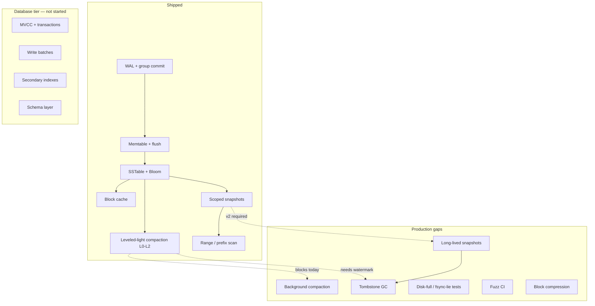

# ParadeKV — Production Engine Readiness

This document defines what **production-grade** means for ParadeKV as an embeddable DB engine (not a publishable alpha crate), inventories what exists today, and lists the gaps that must close before running unattended 24/7 workloads.

**Audience:** engineers deciding what to build next.  
**Last updated:** 2026-06-07 (post Tier 1 engine completion + 30-min soak validation).

Related docs: [`ENGINE-GA.md`](ENGINE-GA.md), [`ARCHITECTURE.md`](ARCHITECTURE.md), [`STATUS.md`](STATUS.md) (partially stale — see note at bottom), [`BACKLOG.md`](BACKLOG.md), [`master-plan.md`](../master-plan.md).

---

## Definition of done

A production-ready ParadeKV **engine** must satisfy all of the following:

| Criterion | Meaning |
|-----------|---------|
| **Durability** | Crash recovery is correct for every syscall failure mode you can inject (partial write, torn WAL, fsync lie, disk full). |
| **Steady state** | 24h+ soak shows bounded RSS, bounded SSTable count per level, stable p99 — not just “no errors for 30 minutes.” |
| **Non-blocking compaction** | Compaction never stalls the write path for seconds. Foreground inline compaction is not acceptable at scale. |
| **Space reclamation** | Tombstones and superseded versions are garbage-collected. Deleted data leaves disk. |
| **Backup / PITR** | Long-lived snapshots pin SSTables and memtable views so online backup and replication checkpoints are possible. |
| **Observability** | Metrics + operator controls (flush, compact, freeze) sufficient to run without reading source code. |
| **Verification gates** | Fuzzing, resilience tests, and coverage thresholds enforced in CI — not “we ran tests once.” |

The **server** layer (HTTP, native protocol, auth, quotas) can ship separately, but production *database* readiness also requires MVCC, write batches, and indexes — none of which exist yet.

---

## What we have today

### Storage core (solid foundation)

| Component | Status | Notes |
|-----------|--------|-------|
| Segmented WAL | ✅ | CRC32 per record, fsync, torn-tail detection, segment rollover, in-flight backpressure |
| Group commit | ✅ | Coalesced fsync; durability watermark tracked |
| WAL shipping | ✅ | Off-box durability via `wal_ship_dir` + `shipped.log` |
| Memtable + immutable queue | ✅ | Freeze, flush threshold, backpressure gauge |
| SSTable format | ✅ | Block-based, sparse index, footer + magic, Bloom filter (xxh3) |
| Manifest + recovery | ✅ | R1–R3 invariants, atomic publish, orphan cleanup on open |
| Internal keys / MVCC-ready ordering | ✅ | `(user_key ASC, seq DESC)` — read path seeks newest version |
| Sequence allocator | ✅ | Strictly monotonic under contention |
| TTL | ✅ | Lazy expiry on read; sweep cadence not implemented |
| Graceful shutdown | ✅ | Flush + manifest checkpoint + `CLEAN_SHUTDOWN` marker |

### Tier 1 read path + compaction (recently shipped)

| Component | Status | Notes |
|-----------|--------|-------|
| Block cache | ✅ | LRU keyed by `(sstable_id, block_offset)`, default 256 MB, hit/miss/eviction metrics |
| Merge iterators | ✅ | k-way merge, Dedup (reads) and Raw (compaction) modes |
| Range / prefix scan | ✅ | `Engine::scan`, `prefix_scan`, `SnapshotView::scan` |
| Scoped snapshots | ✅ | `SnapshotView` — borrow-based, blocks writes while held |
| Leveled-light compaction | ✅ | L0 → L1 → L2, planner + atomic publish, 34 jobs in 30-min soak |
| L0 backpressure | ✅ | Stall writes when L0 exceeds trigger |
| Compaction failpoints | ✅ | Crash matrix covers compaction paths (requires `--features failpoints`) |

Default compaction config (`CompactionConfig`):

- L0 trigger: 4 files  
- Levels: 0–2 (max_level = 2)  
- L1 target: 256 MB, 10× ratio between levels  
- Output file size: 64 MB  
- **Foreground only:** compaction runs inline after flush (max 4 jobs per flush)

### Server layer (managed-service spine — not engine, but real)

| Component | Status |
|-----------|--------|
| HTTP REST (`/v1/db/...`) | ✅ Primary client surface |
| Native binary protocol (TCP) | ✅ |
| RESP2 (loopback, opt-in) | ✅ |
| Multitenancy (key composition) | ✅ Server-side |
| API key auth (hashed in system keyspace) | ✅ |
| Per-tenant durable quotas | ✅ via `WritePolicy` |
| Rate limits, auth cache | ✅ |
| Prometheus metrics (engine + server) | ✅ |

### Test & verification posture

| Layer | Status |
|-------|--------|
| Unit + integration tests (`paradekv-engine`) | **144 passing** (default `cargo test -p paradekv-engine`) |
| Property tests (`proptest_codecs`, `model.rs`) | ✅ |
| Crash matrix (failpoints) | ✅ 30 cases — run with `--features failpoints --test crash_matrix -- --test-threads=1` |
| Format version fixtures | ✅ |
| Fuzz targets (local) | ⚠️ 4 targets exist (`wal_parser`, `sstable_reader`, `ipc_envelope`, `resp_parser`) — **not in CI, not OSS-Fuzz** |
| Disk-full / fsync-lie injection | ✅ `resilience_failpoints.rs` (recovery tests; CI failpoints job) |
| Concurrent reader tests | ❌ Not implemented |
| Coverage gate (≥85%) | ❌ CI runs `cargo llvm-cov` informational only |
| Miri (UB detection) | ❌ Not wired |
| 24h engine soak | ❌ Only 30 min validated in-process (`engine-soak`) |

---

## Soak evidence (30 min @ 3k ops/sec, 70% put / 25% get)

Runs: `soak-runs/postfix-3k-30m/` (pre-compaction baseline) vs `soak-runs/postfix-3k-30m-final/` (Tier 1).

| Metric | Baseline (no compaction) | Tier 1 final |
|--------|--------------------------|--------------|
| Avg throughput | 2914 ops/sec | 2864 ops/sec (−1.7%) |
| Errors | 0 | 0 |
| Final RSS | **2.33 GB** | **566 MB** (−75%) |
| Final live SSTables | 35 (all unmerged) | 33 (L0+L1+L2) |
| Compaction jobs | 0 | 34 |
| p99 (early → late) | ~104–139 µs stable | ~107 µs → **148–431 µs** (2–3× drift) |
| Worst single-op latency | ~1.3 ms | **7.3 s** (foreground compaction at ~421s, ~848s) |
| Block cache hit rate | N/A | ~62% → ~44% as L2 grew |
| L2 file count (end) | N/A | **26 files** (still climbing) |

**Interpretation:** Tier 1 fixed the memory cliff and proved compaction + block cache work. It did **not** prove long-run steady state or production tail latency. Foreground compaction is the dominant risk.

---

## What's missing — gap analysis

Prioritized for a **production DB engine**. Items are blocking unless marked “enhancement.”

### Tier 0 — Blockers (do not run paying workloads)

#### 1. Background compaction

**Problem:** Compaction runs on the write/flush path. Soak showed **3–7 second stalls** (`max_us` up to 7,295,331 µs).

**Required:**
- Dedicated compaction worker (thread or glommio task) executing the existing `compact_once` body
- Write path never blocked by compaction
- Smarter backpressure when compaction falls behind (L0 stall alone is insufficient)
- Compaction rate limiting so disk saturation doesn't starve reads

**Code anchor:** inline compaction after flush in `engine.rs` (~lines 1048–1062); planner already pure in `compaction.rs`.

#### 2. Long-run steady state

**Problem:** 30 minutes is not proof. L2 grew from 0 → 26 files with no ceiling. p99 drifted 2–3×. SSTable count still climbing at shutdown (33 live).

**Update (2026-06):** Overlap-merge leveled compaction shipped: L1→L2 gathers overlapping L2 files (RocksDB-style); steady-state repack removed (repack-at-4 caused 1,911 jobs / 0.94 throughput in `phase1-repack-fix`). MEMO2: L2 removed from compaction scorer; emergency repack deleted; no-progress same-level guard added (`phase1-memo2-delete-repack-90m`: repack=0, 98.3% throughput; old flat L2≤10 gate was wrong). **MEMO3:** analyzer gates fixed (bytes-derived L2, write_amp, rejection counter); flush+compaction apply decoupled onto `paradekv-apply` thread (manifest fsync before catalog swap); per-window `block_cache_hit_rate_window` in soak. **90m gate:** `phase1-memo3-apply-decouple-90m` — see [L2-SCHEDULING-AND-SOAK.md](L2-SCHEDULING-AND-SOAK.md).

**Required:**
- 24h minimum soak with scan mix (`engine-soak --scan-pct 30`)
- Proof that per-level file counts and disk usage **plateau**
- L2 lifecycle: overlap-merge on promotion only; L2 is destination-only (no self-compaction)

#### 3. Tombstone / version garbage collection

**Problem:** Compaction keeps **every version of every key** (explicit in `compact_once` comments). Deletes never reclaim disk beyond shadowing at read time.

**Required:**
- Oldest-live-snapshot seq watermark
- Drop tombstones and superseded versions below watermark during compaction
- Depends on long-lived snapshots (below) for safe watermark computation

#### 4. Long-lived snapshots (PITR / backup)

**Problem:** `SnapshotView` borrows `&Engine` and blocks all mutations. Cannot hold a consistent view across writes, flushes, or compaction. Online backup is impossible.

**Required:**
- Owned snapshots with SSTable ID pinning + deferred unlink
- Memtable Arc snapshot at capture time
- Retention protocol against compaction (designed in Tier 1 plan, not shipped)
- Engine API: `Engine::snapshot_owned() -> SnapshotHandle` with explicit release

**Code anchor:** `snapshot.rs` documents v1 vs v2 trade-off.

#### 5. Resilience testing (Phase 2)

**Problem:** Crash matrix covers failpoint panics/errors. It does not cover operational failure modes.

**Required:**
| Test | Purpose |
|------|---------|
| Disk full on WAL append, SSTable write, manifest fsync | Prove graceful `EngineBusy` / recovery, no corruption |
| Fsync lie (mock or LD_PRELOAD) | Prove replay detects torn state |
| Concurrent readers + single writer | Snapshot consistency under mixed load |
| Bloom FPR validation at scale | Confirm false-positive rate matches design |

#### 6. Fuzzing in CI

**Problem:** Four local fuzz targets exist; none run in CI or OSS-Fuzz. Every on-disk format is an attack surface against your own durability.

**Required:**
- `cargo fuzz` in CI (nightly or PR gate)
- OSS-Fuzz integration for WAL, SSTable, manifest parsers
- Corpus seeding from crash matrix fixtures

---

### Tier 1 — Required for predictable production performance

#### 7. Block compression

SSTable blocks stored uncompressed. Disk and cache efficiency are 3–5× worse than competitors. Footer format is versioned — add zstd or lz4 at block level.

#### 8. Scan-resistant block cache

Cache hit rate fell to ~44% as L2 grew (scans + compaction thrash LRU). Production engines bypass cache for scan/compaction paths or use priority tiers.

#### 9. Read amplification control

With 26+ L2 files, every GET may probe multiple Bloom filters. p99 degradation in soak second half correlates with L2 growth. Deeper leveled compaction or min/max key skipping in manifest (partially in BACKLOG) bounds file count.

#### 10. Engine operator control API

Internal hooks exist; production needs a stable surface:

- `flush()` / `flush_and_wait()`
- `compact_range()` / `force_compact(level)`
- `freeze_writes()` for maintenance
- `estimate_disk_bytes()` / per-level breakdown
- Runtime config for cache size, compaction triggers (many limits still hardcoded in `keys.rs`)

#### 11. Configurable limits

`MAX_KEY_BYTES`, memtable flush threshold, immutable queue depth, block size — compile-time or fixed defaults today. Production deployments need per-instance tuning.

---

### Tier 2 — Required to call it a *database* (not just KV)

These align with [`master-plan.md`](../master-plan.md) Sprints 3–5. None ship today.

| Capability | Status | Why it matters |
|------------|--------|----------------|
| MVCC + snapshot isolation | ❌ | `seq` exists; no tx model, no GC scheduling |
| Multi-key write batches / atomic commits | ❌ | Schema/index updates need all-or-nothing |
| Secondary indexes | ❌ | Every query is primary-key lookup or full scan |
| Schema / catalog layer | ❌ | Engine stores opaque bytes |
| Query planner | ❌ | Reserved IPC codes only |

The read path already routes through `SnapshotView` and `MergingIterator` — the upgrade path is real, but the work is substantial.

---

### Tier 3 — Production ship gates (hygiene)

| Gate | Status |
|------|--------|
| 24h+ soak (scan + snapshot workload) | ❌ |
| `cargo-fuzz` + OSS-Fuzz | ❌ |
| Miri on engine crate | ❌ |
| Coverage ≥85% on codecs + engine core | ❌ measured |
| Benchmark regression CI (criterion) | ❌ |
| Operator runbook (recovery, corruption, capacity) | ❌ |
| `engine.rs` refactor (~1800 LOC monolith) | ❌ — maintainability debt |
| Stale doc sync (`STATUS.md`, `BACKLOG.md` still say compaction/block cache are deferred) | ❌ |

---

## Recommended work order

Do these in sequence. Do not skip ahead to relational features until Tier 0 is green.

```
1. Background compaction worker
       ↓
2. 24h soak + L2 lifecycle strategy
       ↓
3. Long-lived snapshots + tombstone GC
       ↓
4. Phase 2 resilience tests (disk full, fsync lie)
       ↓
5. Fuzzing in CI + OSS-Fuzz
       ↓
6. Block compression + scan-resistant cache
       ↓
7. MVCC + write batches  →  database tier begins
```

**Exit criteria for “production KV engine”:** steps 1–5 complete, 24h soak clean (0 errors, plateau metrics, p99 within agreed SLO, no multi-second stalls).

**Exit criteria for “production database engine”:** steps 1–7 plus indexes and schema layer.

---

## Architecture snapshot



---

## What not to confuse with production readiness

These are real accomplishments but **do not** substitute for the gaps above:

- 144 tests passing — good, not sufficient without fuzz + resilience + long soak
- 3k ops/sec for 30 min with 0 errors — good throughput proof, not steady-state proof
- RSS bounded at 566 MB — largely block cache cap, not proof L2 stops growing
- Server auth/quotas/multitenancy — production *service* features; engine can still stall for 7 seconds
- Redis-compatible wire protocols — compatibility layer, not storage engine correctness

---

## Stale documentation note

[`STATUS.md`](STATUS.md) and [`BACKLOG.md`](BACKLOG.md) predate Tier 1. They still list compaction and block cache as deferred. **This document supersedes those sections for engine readiness.** Update STATUS/BACKLOG when Tier 0 work begins.

---

## Key file references

| Area | Path |
|------|------|
| Engine integration | `crates/engine/src/engine.rs` |
| Compaction planner | `crates/engine/src/compaction.rs` |
| Snapshots (scoped v1) | `crates/engine/src/snapshot.rs` |
| Block cache | `crates/engine/src/block_cache.rs` |
| Merge iterators | `crates/engine/src/iter.rs` |
| In-process soak harness | `crates/engine/src/bin/engine-soak.rs` |
| Baseline soak metrics | `soak-runs/postfix-3k-30m/metrics.jsonl` |
| Tier 1 soak metrics | `soak-runs/postfix-3k-30m-final/metrics.jsonl` |
| Fuzz targets | `fuzz/fuzz_targets/` |
| MVCC design ADR | `docs/adr/0002-mvcc-design.md` |
